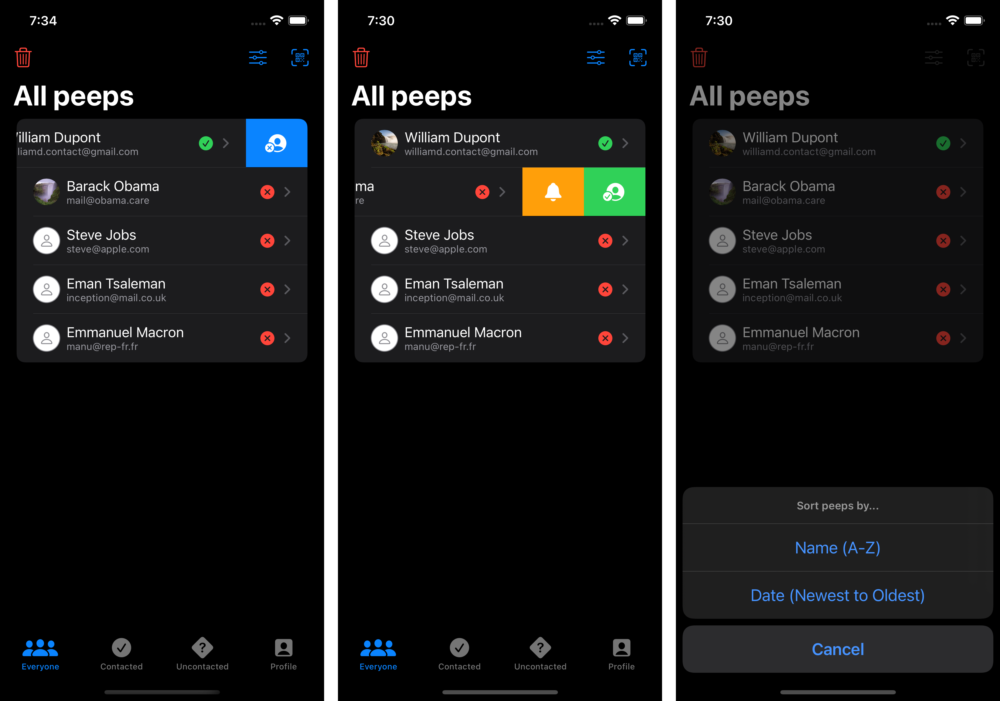
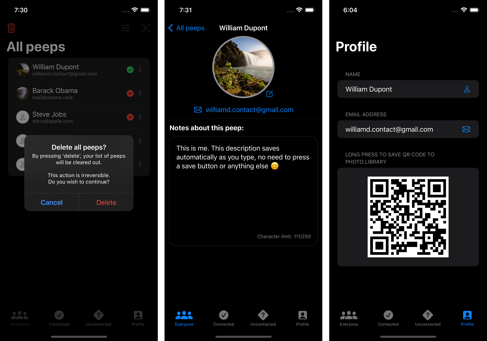
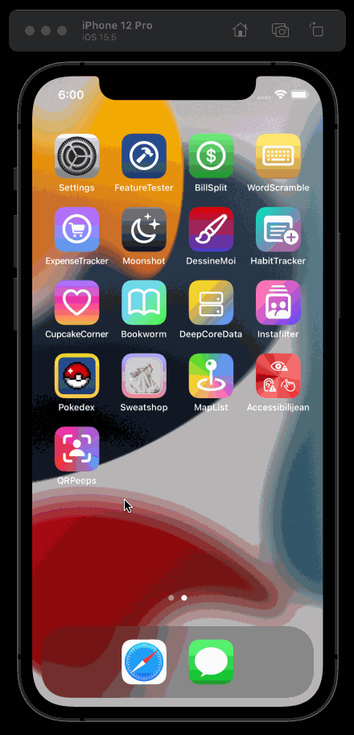

# QRPeeps
Ever been somewhere cool and met new people that you'd like to stay in touch with?
QRPeeps allows you do just that.

Scan their QR code to add them to your list of Peeps (QRPeeps' fancy way of saying _people_ 😄).

Schedule a local notification to remind you to contact them (currently set for 9am. Early birds only 🐥)

Mark your peeps, sort them, stick'em in a stew. 🥔🥣

Generate your own QR code for people to scan so they can do the same with you. 📸

## How
This app uses 2 packages:
* [AirBnB Lottie iOS](https://github.com/airbnb/lottie-ios)
* [Paul Hudson's QR code scanner](https://github.com/twostraws/CodeScanner)

## App icon
Made using Figma.

  

## Media

  
  
  

## Preview GIF
Lottie empty state app demo.

  

## In progress
* MVVM pattern
* Error handling (needs improvement)
* Prevent being able to add same person more than once
* NavigationLink for each Peep to allow for:
  * Detailed view of selected Peep
  * Editing of selected Peep (add picture, other...)
